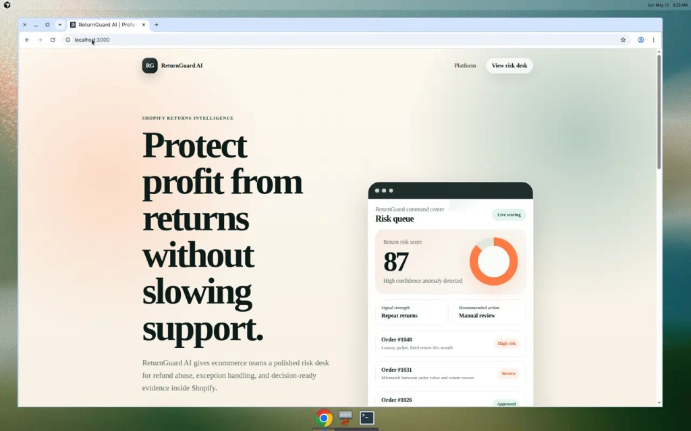
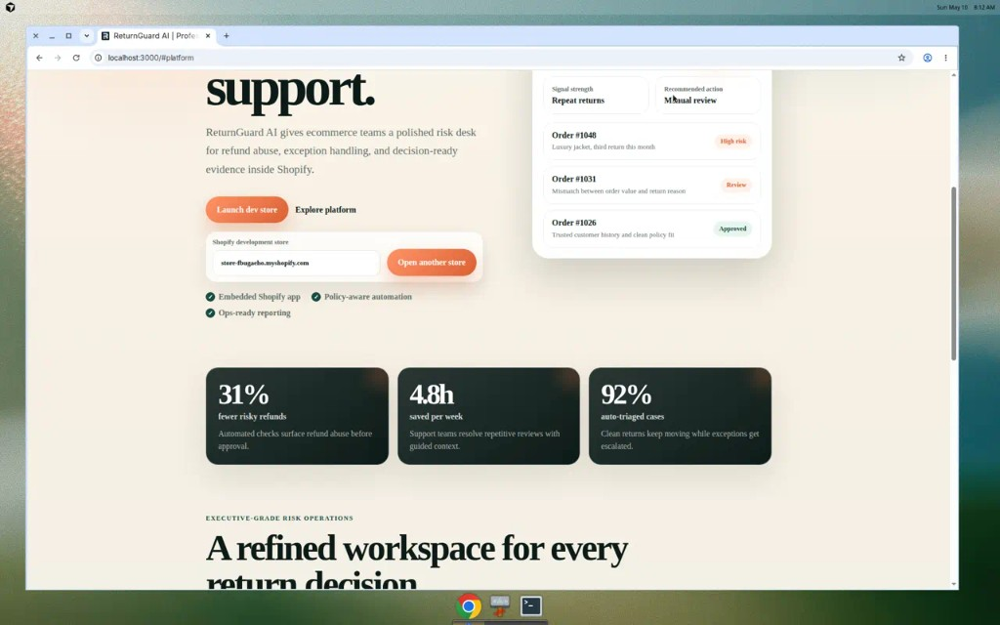
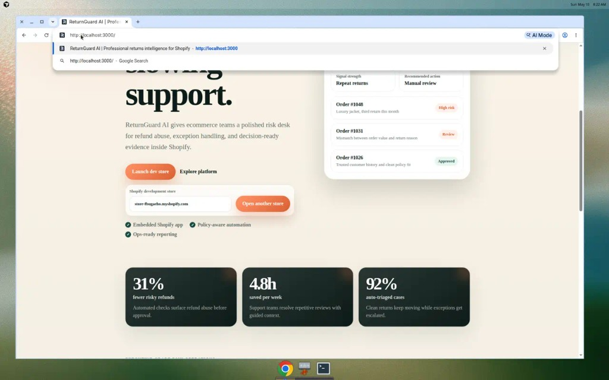
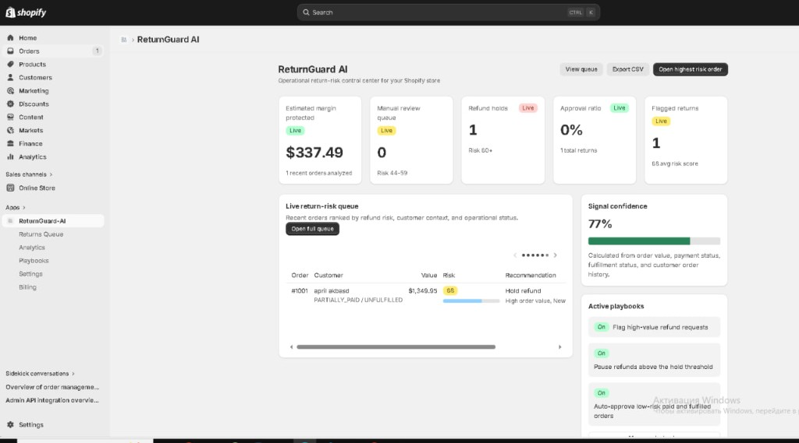
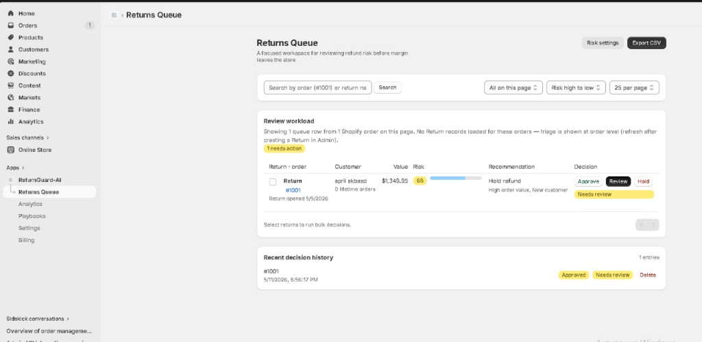
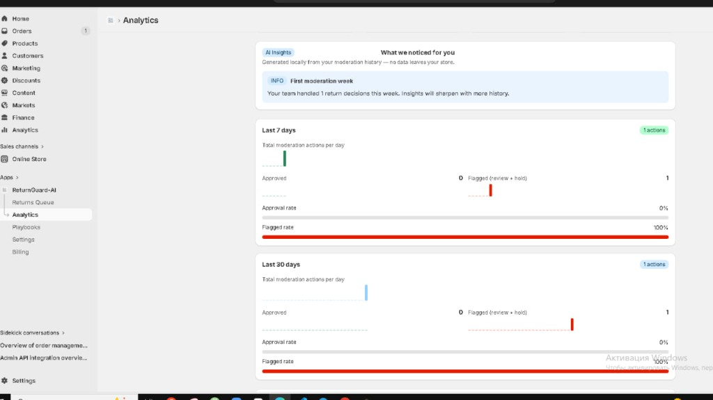
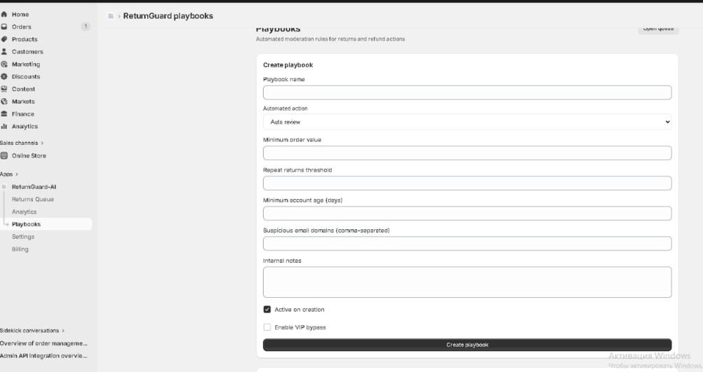
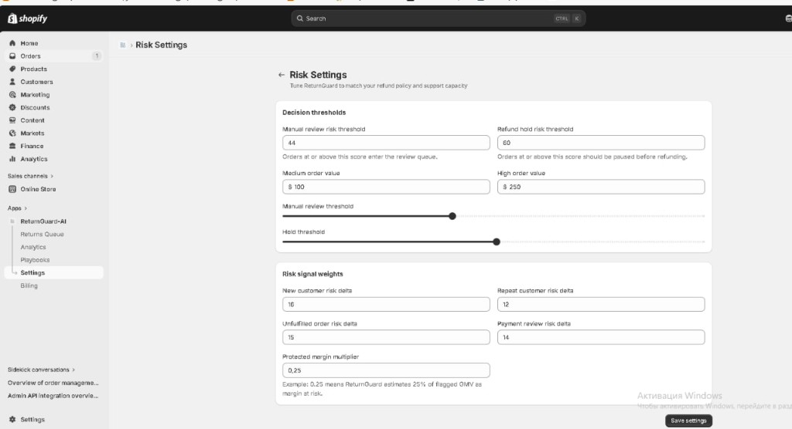
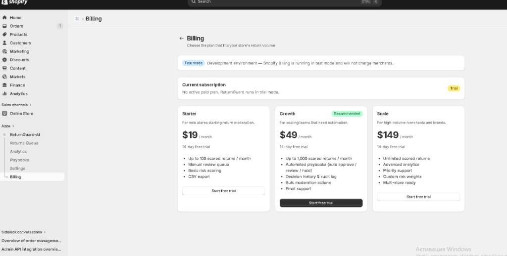

# ReturnGuard AI

ReturnGuard AI is a Shopify embedded app concept for returns intelligence. It
scores risky return requests, gives support teams a review queue, and presents a
clean product-style landing page for demos.

## Product surface

- Dashboard with risk KPIs, recent queue items, and recent moderation actions.
- Returns Queue with Shopify return/order rows, search, pagination, filters,
  bulk decisions, and CSV export.
- Analytics with decision trends, approval rate, flagged rate, and local
  insights from the audit trail.
- Audit Log with searchable decision history for approvals, reviews, and holds.
- Playbooks for automated moderation rules.
- Risk Settings for thresholds and signal weights.
- Billing with Shopify recurring subscriptions in development test mode.

## Demo

- YouTube demo: [ReturnGuard AI demo](https://youtu.be/jBtjtRoBxRU)

## Local Startup Demo

Use this when you want the project to look like a polished standalone startup
site in the browser.

```shell
npm install
npm exec remix vite:dev -- --host 127.0.0.1 --port 3000
```

Open http://127.0.0.1:3000/.

The local landing page uses development fallback values for Shopify credentials,
so it can render without a tunnel. Real Shopify Admin routes still need Shopify
authentication.

## Shopify Embedded App Demo

Use this when you want to show the real app inside Shopify Admin.

```shell
npm install
npm run setup
npm run dev
```

The `dev` script runs:

```shell
shopify app dev --store store-fbugaeho.myshopify.com
```

Shopify CLI will log you in, create a tunnel, inject environment variables, and
open the embedded app flow for the configured development store.

## Production Deployment

Production uses PostgreSQL through `prisma-postgres/schema.prisma`. Local
development keeps using SQLite through `prisma/schema.prisma`.

See [docs/DEPLOYMENT.md](docs/DEPLOYMENT.md) for the Supabase + Render setup.

## Checks

```shell
npx tsc --noEmit
npm run lint
npm run build
```

Current known warnings:

- Polaris CSS produces an esbuild minify warning for a generated media query.
- `npm audit` reports dependency advisories inherited from the Shopify/Remix
  template. `npm audit fix` cannot safely resolve all of them without breaking
  upgrades.

## Landing Redesign Walkthrough

- Video walkthrough: [Landing redesign (Cursor artifact)](https://cursor.com/agents/bc-860782ab-9fa9-47ba-8288-595bd9cc8f38/artifacts?path=%2Fopt%2Fcursor%2Fartifacts%2Flanding_redesign_verified_walkthrough.mp4)

## Screenshots

### Landing Page





### Embedded App (Shopify Admin)

Operational dashboard, queue, analytics, audit history, automation, risk tuning,
and billing inside the embedded app.












